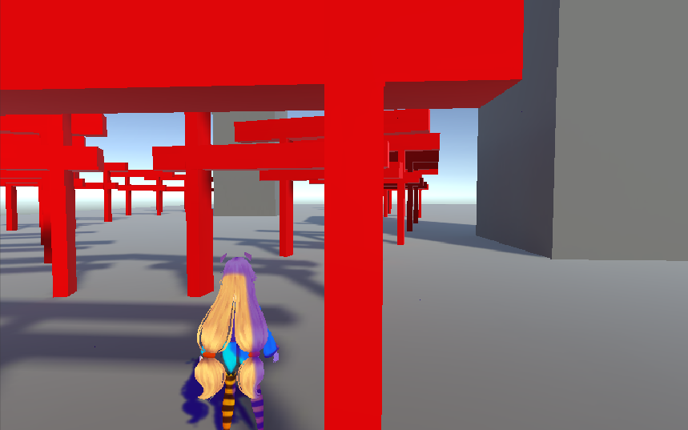
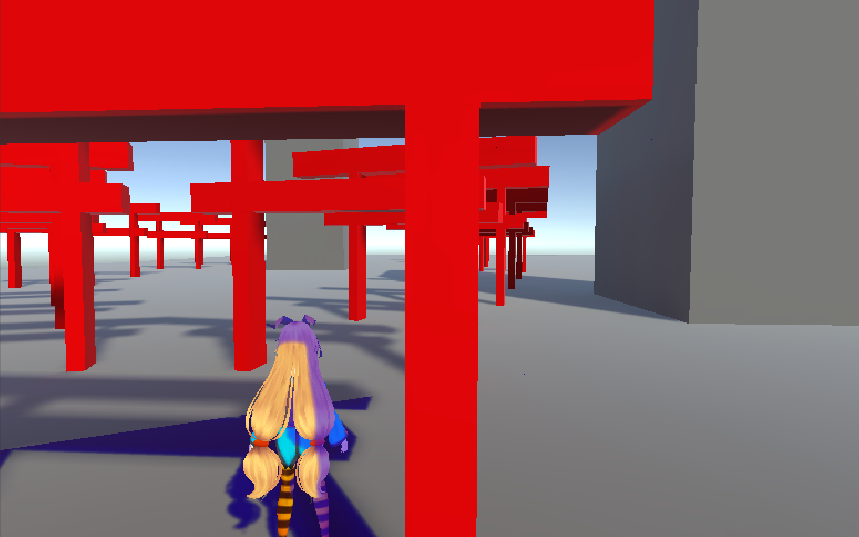
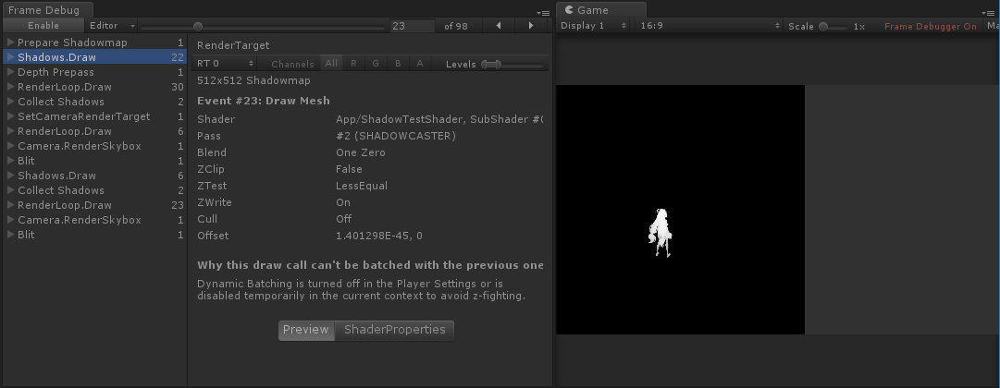
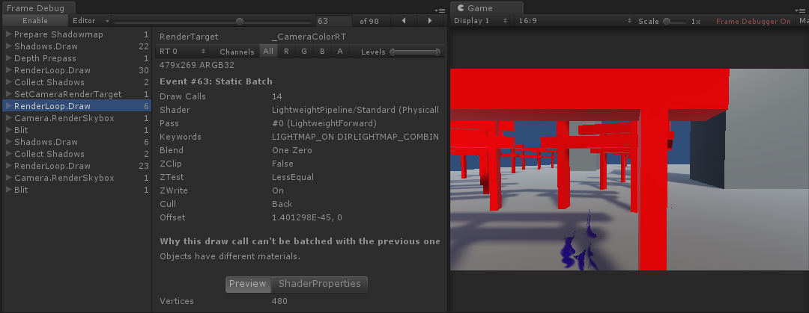
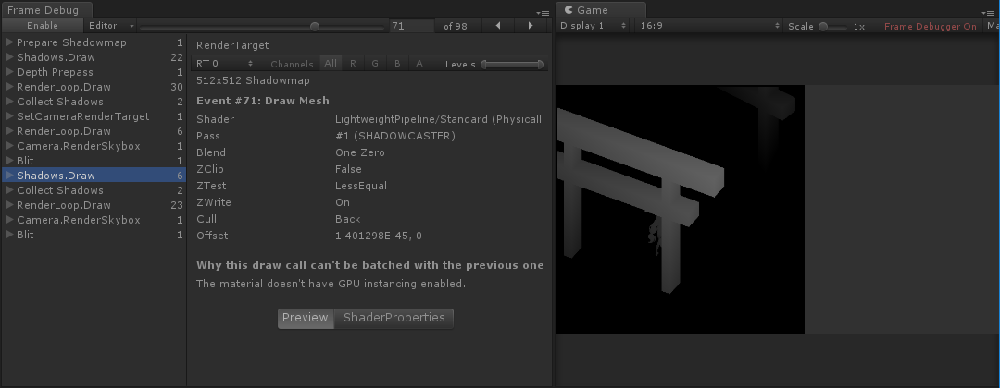
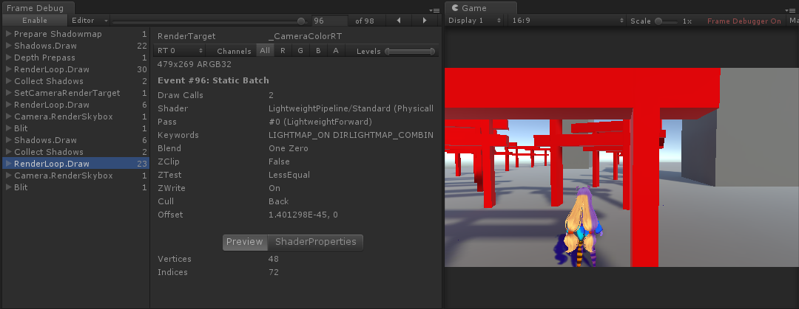

# MixedShadowSample

Read this in other languages: English, [日本語](README.ja.md) 

## Original Source
  https://github.com/Unity-Technologies/ScriptableRenderPipeline  
  Customized from "LWRP 1.1.8-preview".

## Image

### Customed RenderPipeline
  

* Realtime shadow renders blued. Baked shadow renders blacked.

### Non-Customized "LWRP" 
Non-Customized "LWRP" renders like this. 
The ground is recieved realtime shadow from BG Objcets.

  

## RenderPass Flow

1.Generate ShadowMap renders only Character. 
  

2.Rendering BG Objects with ShadowMap(CharacterOnly) 
  

3.Rebdering Character to ShadowMap. 
  

4.Render Character with ShadowMap. 
  

## Why?
 - This makes the rendering shadow cost lower.Because we should only care around the Character. 
 - We can make ShadowMapTexture lower resolution because the shadow distance become shorter. 
 - BG shadows are baked. So its quality is high.

